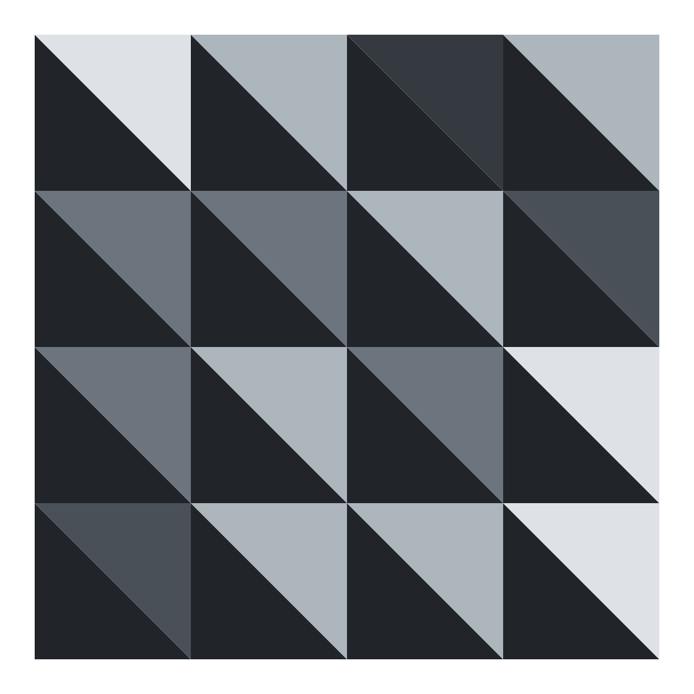
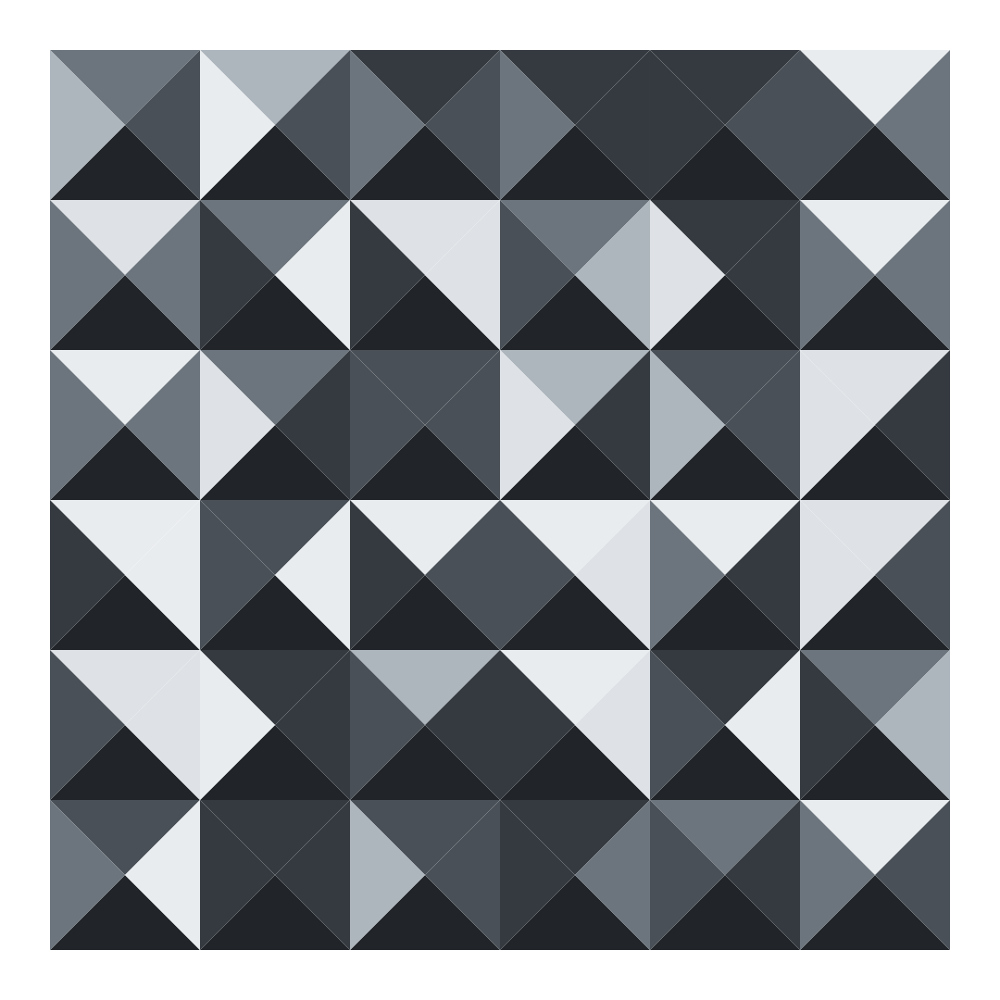

# canvas-sketches-geometry
Geometry designs using canvas-sketch library.

----------------------------------------------------------------

## Pre-requisites

- [canvas-sketch](https://github.com/mattdesl/canvas-sketch).
----------------------------------------------------------------

## Commands 

Expoting images 
```
canvas-sketch index.js --output=output/
```
----------------------------------------------------------------
## Art created
**Triangle columns**


**Triangles in sqare cells**



**Qadruple triangles in sqare cells**



**Sqare segments**


